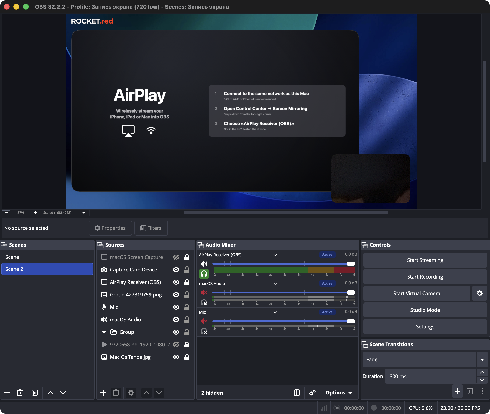
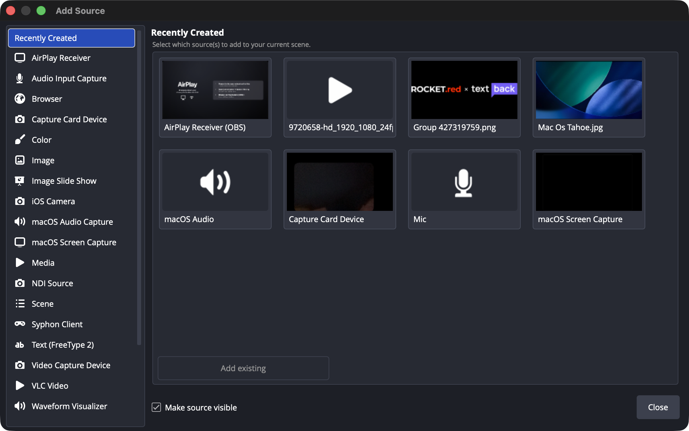
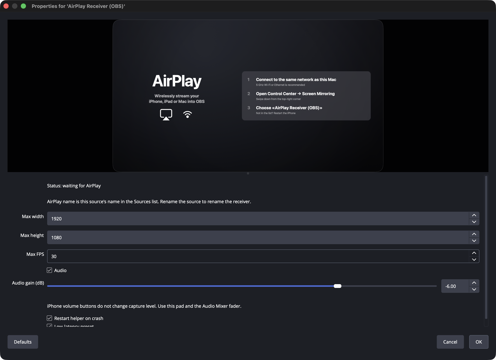
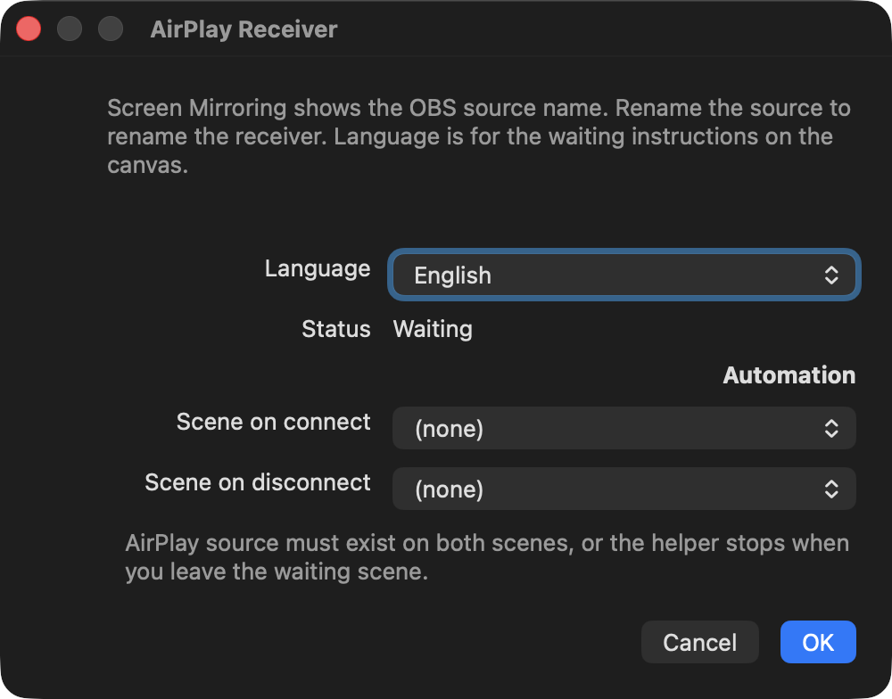

# AirPlay Receiver for OBS

[](https://github.com/dgraid/obs-airplay-plugin/releases/latest)
[](https://github.com/dgraid/obs-airplay-plugin/releases)
[](LICENSE)

**AirPlay OBS plugin** for Apple Silicon: iPhone / iPad / Mac **Screen Mirroring** into [OBS Studio](https://obsproject.com/) as a source named **AirPlay Receiver**. Video + audio.

Not an official OBS Project plugin. Not affiliated with Apple or Zoom.

macOS 13+ · arm64 · OBS Studio **32.2.2**

**Download (macOS Apple Silicon):** [obs-airplay-0.2.1-macos-arm64.pkg](https://github.com/dgraid/obs-airplay-plugin/releases/latest/download/obs-airplay-0.2.1-macos-arm64.pkg)



> **iPhone shot:** Control Center → Screen Mirroring and a live mirror in the preview are not in this README yet. They need a phone on the same Wi-Fi. The OBS UI shots below are from this Mac.

## What you get

| | |
|---|---|
| Source | **AirPlay Receiver** in Sources → + |
| AirPlay name | The OBS source name (rename the source to rename the receiver) |
| Idle | Full-canvas instruction card (not a black box) |
| Live video | Letterboxed into the OBS canvas; transparent margins, scene shows through |
| Audio | PCM into OBS; pad default **−6 dB** (source properties). iPhone volume buttons do not change capture level |
| Crash isolation | Protocol/decode run in `AirPlayReceiverHelper.app`. Killing the helper must not kill OBS |

## Install

Quit OBS first.

**Installer:** double-click [obs-airplay-0.2.1-macos-arm64.pkg](https://github.com/dgraid/obs-airplay-plugin/releases/latest/download/obs-airplay-0.2.1-macos-arm64.pkg) (also on [Releases](https://github.com/dgraid/obs-airplay-plugin/releases)). No admin password. Payload:

`~/Library/Application Support/obs-studio/plugins/obs-airplay.plugin`

Does **not** write into `/Applications/OBS.app`.

From this tree:

```bash
./scripts/package_pkg.sh   # → dist/obs-airplay-0.2.1-macos-arm64.pkg
./scripts/install.sh
```

### Gatekeeper (unsigned package)

There is no Apple Developer ID, so the `.pkg` is **not notarized**. After a download from the internet:

1. Control-click the `.pkg` → **Open**, or
2. System Settings → Privacy & Security → **Open Anyway**

AirDrop/USB often skip that prompt.

### Uninstall

```bash
./scripts/uninstall.sh
```

## Use

1. OBS → Sources → **+** → **AirPlay Receiver**

   

2. Leave the source on the active scene. The canvas shows the waiting card:

   

3. On iPhone: Control Center → Screen Mirroring → the **source name** (default `AirPlay Receiver`), not `MacBook Air` / the Mac’s own receiver.
4. Video + audio land on the source. Ride level with the source pad and the OBS mixer.

   

5. Tools → **AirPlay Receiver**: stub language (en/ru), connect/disconnect scene automation.

   

Two sources can run at once (`AirPlay Receiver`, `AirPlay Receiver 2`, …). Rename while live restarts that helper (the AirPlay session drops).

Built-in **AirPlay Receiver** on the Mac can stay on. The picker will show several names — pick the OBS source.

## Limits

- Apple Silicon only. No Windows, no Intel Mac.
- OBS 32.2.2 arm64.
- Unsigned `.pkg`.
- 2h soak, Wi-Fi toggle, and reconnect loops still need a real iPhone (see `docs/TEST_REPORT.md`). Lock/unlock and first mirror have been confirmed on this machine.

## Credits

This is a **fork/rewrite** of [mika314/obs-airplay](https://github.com/mika314/obs-airplay) (GPL-2.0), not an official OBS Project plugin.

- Protocol: [UxPlay 1.73.6](https://github.com/FDH2/UxPlay) (GPL-3.0), vendored. Lineage: antimof/UxPlay → RPiPlay / shairplay / playfair.
- Helper process is this project’s design. Zoom AirHost was inspected **read-only** as a process-isolation reference. No Zoom code, identity, or assets.
- OBS Studio plugin API: [obsproject/obs-studio](https://github.com/obsproject/obs-studio) (GPL-2.0).
- Also: libplist, FFmpeg (helper only), fdk-aac, OpenSSL. See `NOTICE` and `docs/DEPENDENCIES.md`.

## How this was built

**Vibe-coded in [Cursor](https://cursor.com)** by the maintainer. Models used on this tree: Cursor Auto, Composer, GPT-5.3 Codex, Grok 4.6.

That is a fact, not a sales pitch. Treat the plugin as experimental. File crashes in Issues. Do not assume OBS Forums will list it: their resource policy discourages mostly-AI plugins even with a disclaimer.

## License

- OBS plugin (`obs-airplay.plugin`): **GPL-2.0-or-later** (same family as upstream obs-airplay / libobs). See `LICENSE`.
- Helper (`AirPlayReceiverHelper.app`) links UxPlay: **GPL-3.0**. See `third_party/UxPlay/LICENSE`.
- fdk-aac: Fraunhofer FDK AAC license (bundled dylib), not GPL.

## Build

`docs/BUILD.md`. Pins: OBS 32.2.2, UxPlay v1.73.6 `21eef8df25d91e12635c36d8176ad192725baca2`.

## Downloads

- Latest `.pkg`: https://github.com/dgraid/obs-airplay-plugin/releases/latest
- Counts (GitHub counts the attached `.pkg`, not the source zip):

```bash
gh api repos/dgraid/obs-airplay-plugin/releases --jq '.[] | {tag: .tag_name, assets: [.assets[] | {name, download_count}]}'
```
